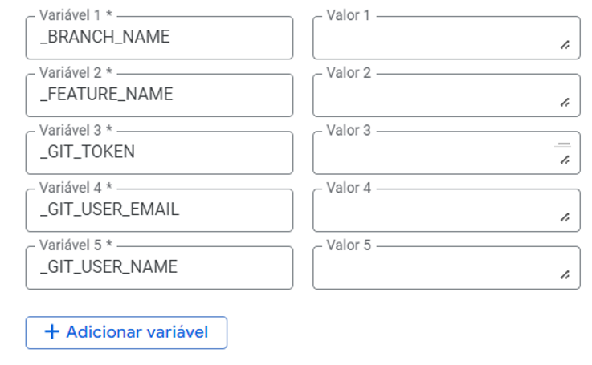

# 📋 Configurações Cloud Build
&nbsp;&nbsp;&nbsp;&nbsp;&nbsp;&nbsp;&nbsp;&nbsp;Dentro do **Cloud Build** na opção "Gatilho" temos as configurações usadas:  

&nbsp;&nbsp;&nbsp;&nbsp;&nbsp;&nbsp;&nbsp;&nbsp;Clique em criar Gatilhos  

**Nome:** 
- Escolha o nome do gatilho

**Eventos:**
- Enviar para uma ramificação.

**Origem:**
- 1º Geração.

**Repositório:**
- Selecione o repositório que você deseja usar.

**Ramificação:**
- Selecione a ramificação que você deseja usar.

**Configuração:**  
* **Tipo:** Arquivo de configuração do Cloud Build (yaml ou json).
* **Local:** Repositório.
* **Local do arquivo de configuração do Cloud Build:** Caminho do arquivo de configuração do arquivo Cloudbuild (exemplo: cloudbuild.yaml).

**Avançado:**
* **Variaves de Substituições:** Coloque as variáveis de substituição que você deseja usar no arquivo cloudbuild.

* **Conta de Serviço:** Escolha a conta de serviço que tenha todas as pemissçoes necessárias para essa aplicação.

[Voltar para o arquivo geral](../over-view.md)