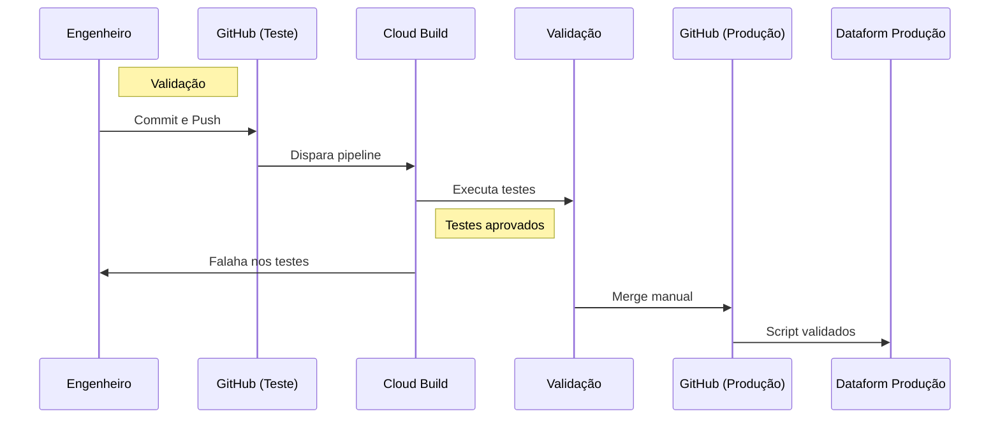

```mermaid
sequenceDiagram
    participant Eng as Engenheiro
    participant GitHub as GitHub (Teste)
    participant CloudBuild as Cloud Build
    participant Validação as Validação
    participant GitProd as GitHub (Produção)
    participant Dataform as Dataform Produção
 
    note right of Eng: Validação
    Eng->>GitHub: Commit e Push 
    GitHub->>CloudBuild: Dispara pipeline 
    CloudBuild->>Validação: Executa testes
    note right of CloudBuild: Testes aprovados
    CloudBuild->>Eng: Falaha nos testes
    Validação->>GitProd: Merge manual
    GitProd->>Dataform: Script validados

    
```
